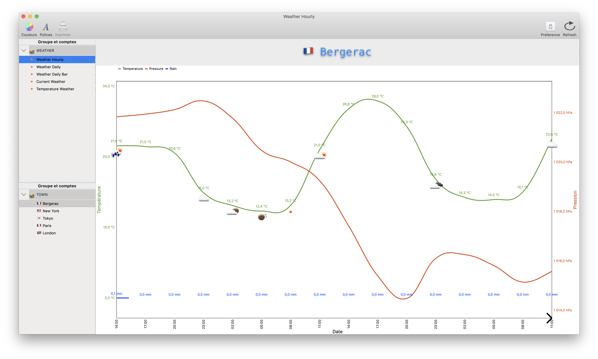

MeteoGraph
========

<em>MeteoGraph in action</em>

# Update

HPOpenWeather supports iOS 9.0+, watchOS 2.0+, tvOS 9.0+ and macOS 10.10+. 

Requirements
------------
Builds and runs on Mac OS X 10.14 or higher. 

Usage
-----
To get started, you need an API key from [OpenWeatherMap](https://openweathermap.org). Put this API key in the initialiser, additionally you can also specify a custom temperature format and/or language used in the responses (see list for available languages and units below).

License
-------
Public domain

